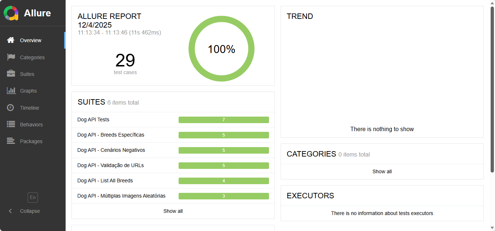

# 🐕 CodeceptJS API Dogs

[](https://opensource.org/licenses/ISC)
[](https://nodejs.org/)
[](https://codecept.io/)
[](https://dog.ceo/dog-api/)

> 🚀 **Suíte de testes automatizados completa para Dog CEO API usando CodeceptJS - 29 cenários abrangentes com validação robusta**

Uma coleção robusta e bem estruturada de testes automatizados para validar todas as funcionalidades da [Dog CEO API](https://dog.ceo/dog-api/), implementada com CodeceptJS para garantir qualidade, confiabilidade e cobertura completa da API.

## 📋 Índice

- [Sobre o Projeto](#sobre-o-projeto)
- [Funcionalidades Testadas](#funcionalidades-testadas)
- [Tecnologias Utilizadas](#tecnologias-utilizadas)
- [Pré-requisitos](#pré-requisitos)
- [Instalação](#instalação)
- [Como Usar](#como-usar)
- [Estrutura dos Testes](#estrutura-dos-testes)
- [Documentação da API](#documentação-da-api)
- [Scripts Disponíveis](#scripts-disponíveis)
- [Cenários de Teste](#cenários-de-teste)
- [Allure Reports - Relatórios Visuais](#allure-reports---relatórios-visuais)
- [Relatórios Tradicionais](#relatórios-tradicionais)
- [Contribuição](#contribuição)
- [Licença](#licença)

## 🎯 Sobre o Projeto

Este projeto foi desenvolvido para demonstrar uma suíte de testes automatizados de alta qualidade usando **CodeceptJS** para validar a Dog CEO API. Os testes cobrem desde cenários básicos até validações avançadas, incluindo:

- ✅ Testes de endpoints principais
- ✅ Validação de estrutura de resposta
- ✅ Cenários negativos e tratamento de erros
- ✅ Validação de URLs e formatos
- ✅ Testes de múltiplas requisições
- ✅ Verificação de breeds específicas
- 📊 Relatórios visuais com **Allure Framework**

## 🔍 Funcionalidades Testadas

### 📊 Endpoints da API
- **GET** `/breeds/list/all` - Lista completa de raças
- **GET** `/breed/{breed}/images` - Imagens de raça específica
- **GET** `/breed/{breed}/{sub-breed}/images` - Imagens de sub-raça
- **GET** `/breeds/image/random` - Imagem aleatória
- **GET** `/breeds/image/random/{count}` - Múltiplas imagens aleatórias

### 🧪 Tipos de Teste
- **Funcionais**: Validação de funcionalidades principais
- **Estruturais**: Verificação de formato de resposta
- **Negativos**: Cenários de erro e exceção
- **Performance**: Validação de múltiplas requisições
- **Integração**: Testes end-to-end da API

## 🛠 Tecnologias Utilizadas

| Tecnologia | Versão | Descrição |
|------------|--------|-----------|
| [Node.js](https://nodejs.org/) | ≥16.0.0 | Ambiente de execução JavaScript |
| [CodeceptJS](https://codecept.io/) | ^3.5.14 | Framework de testes BDD |
| [Allure Framework](https://allurereport.org/) | ^3.4.1 | Geração de relatórios visuais |
| [Allure CommandLine](https://github.com/allure-framework/allure2) | ^2.34.1 | CLI para relatórios Allure |
| [Faker.js](https://fakerjs.dev/) | ^8.4.1 | Geração de dados de teste |
| [Prettier](https://prettier.io/) | ^3.2.5 | Formatação de código |
| [Rosie](https://github.com/rosiejs/rosie) | ^2.1.1 | Factory para objetos de teste |

## ⚡ Pré-requisitos

Antes de começar, certifique-se de ter instalado em sua máquina:

- **Node.js** (versão 16.0.0 ou superior)
- **npm** (versão 8.0.0 ou superior)
- **Git** (para clonar o repositório)

## 📦 Instalação

### 1. Clone o repositório
```bash
git clone https://github.com/ZyamHunter/codeceptjs-api-dogs.git
cd codeceptjs-api-dogs
```

### 2. Instale as dependências
```bash
npm install
```

### 3. Execute o setup completo
```bash
npm run setup
```

## 🚀 Como Usar

### Executar todos os testes
```bash
npm test
```

### Executar com saída detalhada
```bash
npm run test:verbose
```

### Executar em modo debug
```bash
npm run test:debug
```

### Executar testes completos com Allure
```bash
npm run test-all
```

### Gerar relatório Allure
```bash
npm run allure-generate
```

### Abrir relatório Allure
```bash
npm run allure-open
```

### Servir relatório Allure
```bash
npm run allure-server
```

### Limpar resultados anteriores
```bash
npm run clean
```

### Formatar código
```bash
npm run format
```

## 📁 Estrutura dos Testes

```
tests/
├── 📄 dog_api_test.js           # Testes básicos da API
├── 📄 list_all_breeds_test.js   # Testes de listagem completa
├── 📄 breeds_especificas_test.js # Testes de raças específicas
├── 📄 cenarios_negativos_test.js # Testes de cenários de erro
├── 📄 multiplas_imagens_test.js  # Testes de múltiplas requisições
└── 📄 validacao_urls_test.js     # Validação de URLs e formatos
```

## 🌐 Documentação da API

A [Dog CEO API](https://dog.ceo/dog-api/) é uma API RESTful gratuita que fornece imagens aleatórias de cachorros organizadas por raça.

### Base URL
```
https://dog.ceo/api
```

### Endpoints Principais
| Endpoint | Método | Descrição |
|----------|--------|-----------|
| `/breeds/list/all` | GET | Lista todas as raças disponíveis |
| `/breed/{breed}/images` | GET | Lista imagens de uma raça específica |
| `/breed/{breed}/{sub-breed}/images` | GET | Lista imagens de uma sub-raça |
| `/breeds/image/random` | GET | Retorna uma imagem aleatória |
| `/breeds/image/random/{count}` | GET | Retorna múltiplas imagens aleatórias |

## 📜 Scripts Disponíveis

| Script | Comando | Descrição |
|--------|---------|-----------|
| **test** | `npm test` | Executa todos os testes com steps |
| **test:verbose** | `npm run test:verbose` | Executa testes com saída detalhada |
| **test:debug** | `npm run test:debug` | Executa testes em modo debug |
| **test-all** | `npm run test-all` | Executa testes e gera relatório Allure |
| **allure-generate** | `npm run allure-generate` | Gera relatório Allure a partir dos resultados |
| **allure-open** | `npm run allure-open` | Abre o relatório Allure no navegador |
| **allure-server** | `npm run allure-server` | Inicia servidor local para relatório Allure |
| **format** | `npm run format` | Formata código usando Prettier |
| **format:check** | `npm run format:check` | Verifica formatação do código |

## 🧪 Cenários de Teste

### ✅ Testes Funcionais
- Validação de endpoints principais
- Verificação de códigos de status HTTP
- Validação de estrutura de resposta JSON
- Conferência de chaves obrigatórias

### ❌ Testes Negativos
- Breeds inexistentes (404)
- Sub-breeds inválidas
- Endpoints inexistentes
- Caracteres especiais em parâmetros

### 🔍 Validações Específicas
- Formato de URLs de imagens
- Unicidade de imagens aleatórias
- Consistência de dados entre chamadas
- Verificação de tipos de arquivo suportados

### 📊 Análise de Qualidade
- Taxa de unicidade em múltiplas chamadas
- Validação de padrões de URL
- Verificação de breeds conhecidas
- Análise de performance de resposta

## 📊 Allure Reports - Relatórios Visuais

Este projeto utiliza o **Allure Framework** para gerar relatórios visuais ricos e interativos dos resultados dos testes. O Allure oferece uma interface web moderna para análise detalhada dos testes executados.

### 🎯 Resultados dos Testes



**📈 Estatísticas Atuais dos Testes:**
- ✅ **29 testes passaram** (100% de sucesso)
- ❌ **0 testes falharam**
- ⚠️ **0 testes quebrados**
- ⏭️ **0 testes ignorados**
- ⏱️ **Duração total:** ~11.5 segundos
- 🏃 **Tempo mínimo:** 239ms
- 🐌 **Tempo máximo:** 1.223s

### 🚀 Como Usar o Allure

#### 1. Executar testes e gerar relatório automaticamente
```bash
npm run test-all
```

#### 2. Gerar relatório manualmente
```bash
# Primeiro execute os testes
npm test

# Depois gere o relatório
npm run allure-generate

# Abra o relatório
npm run allure-open
```

#### 3. Servir relatório localmente
```bash
npm run allure-server
```

### 📂 Estrutura dos Relatórios Allure

```
allure-results/           # Dados brutos dos testes
├── 🔧 *.json            # Arquivos de resultado
├── 📸 *.png             # Screenshots (se houver falhas)
└── 📋 *.txt             # Logs e attachments

allure-report/            # Relatório HTML gerado
├── 📱 index.html        # Página principal
├── 📊 widgets/          # Gráficos e estatísticas
├── 📁 data/             # Dados estruturados
└── 🎨 styles.css        # Estilização
```

### 🎨 Funcionalidades do Relatório Allure

| Funcionalidade | Descrição |
|----------------|-----------|
| **📊 Dashboard** | Visão geral com gráficos e estatísticas |
| **🔍 Suites** | Organização por arquivos de teste |
| **📈 Trends** | Histórico de execuções (quando disponível) |
| **🏷️ Categories** | Classificação de falhas por categoria |
| **⏱️ Timeline** | Linha do tempo da execução |
| **📋 Behaviors** | Agrupamento por funcionalidade |
| **📦 Packages** | Estrutura por pacotes/diretórios |

### 🔧 Configuração Allure

O projeto está configurado com as seguintes opções no `codecept.conf.js`:

```javascript
plugins: {
  allure: {
    enabled: true,
    require: 'allure-codeceptjs',
    outputDir: './allure-results',
  },
  stepByStepReport: {
    enabled: true,
    screenshotsForAllureReport: true,
    fullPageScreenshots: true,
  }
}
```

## 📈 Relatórios Tradicionais

Além dos relatórios **Allure** (recomendados), os resultados dos testes também são salvos na pasta `output/` e incluem:

- **Screenshots** em caso de falhas
- **Logs detalhados** de execução  
- **Relatórios HTML** básicos
- **Arquivos JSON** com dados de resposta

### Visualizar Resultados Tradicionais
```bash
# Os arquivos de saída estarão em:
./output/
```

> 💡 **Recomendação:** Use os relatórios Allure para uma experiência muito mais rica e visual!

## 🤝 Contribuição

Contribuições são sempre bem-vindas! Para contribuir:

1. **Fork** o projeto
2. Crie uma **branch** para sua feature (`git checkout -b feature/AmazingFeature`)
3. **Commit** suas alterações (`git commit -m 'Add some AmazingFeature'`)
4. **Push** para a branch (`git push origin feature/AmazingFeature`)
5. Abra um **Pull Request**

### 🐛 Reportar Bugs
Para reportar bugs, [abra uma issue](https://github.com/ZyamHunter/codeceptjs-api-dogs/issues) com:
- Descrição detalhada do problema
- Passos para reproduzir
- Resultado esperado vs resultado obtido
- Screenshots (se aplicável)

## 📄 Licença

Este projeto está sob a licença **ISC**. Veja o arquivo [LICENSE](LICENSE) para mais detalhes.

---

## 👨‍💻 Autor

**ZyamHunter**
- GitHub: [@ZyamHunter](https://github.com/ZyamHunter)
- Projeto: [codeceptjs-api-dogs](https://github.com/ZyamHunter/codeceptjs-api-dogs)

---

## 🙏 Agradecimentos

- [Dog CEO](https://dog.ceo/) pela API gratuita e de qualidade
- [CodeceptJS Team](https://codecept.io/) pelo excelente framework de testes
- Comunidade de desenvolvedores que contribuem para o ecossistema de testes

---

<div align="center">

**🐕 Happy Testing! 🐕**

*Desenvolvido com ❤️ e muita dedicação para garantir a qualidade da Dog CEO API*

</div>